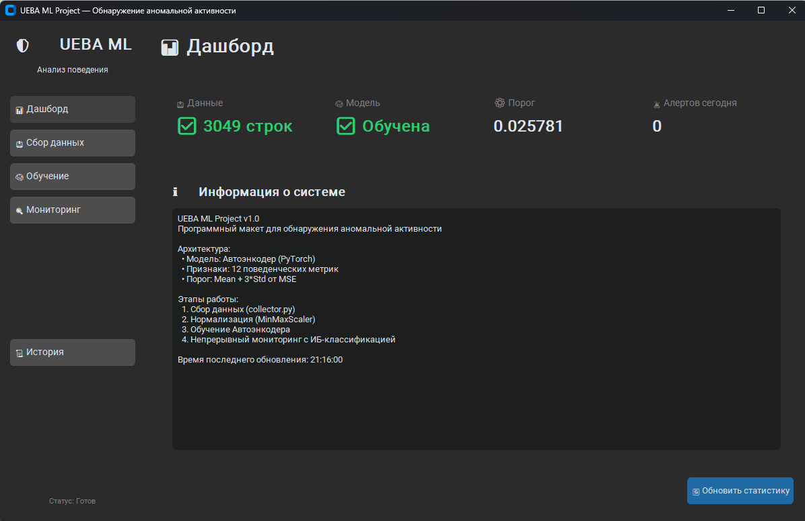
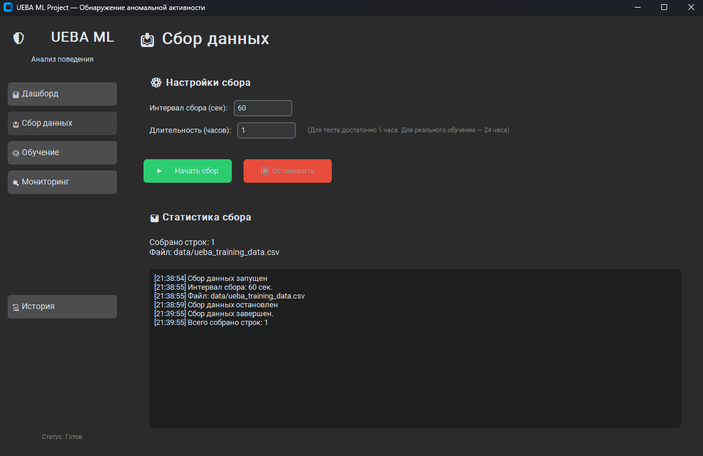
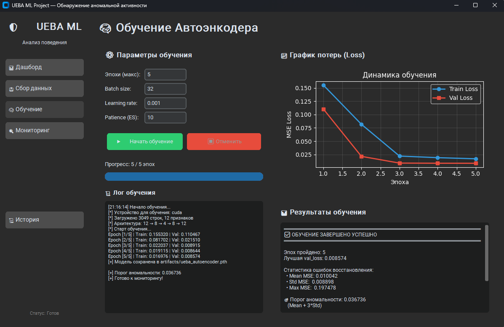
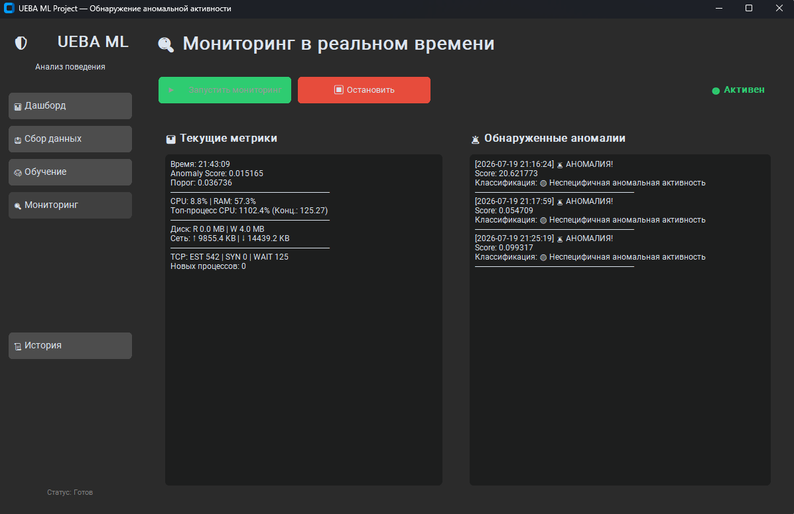
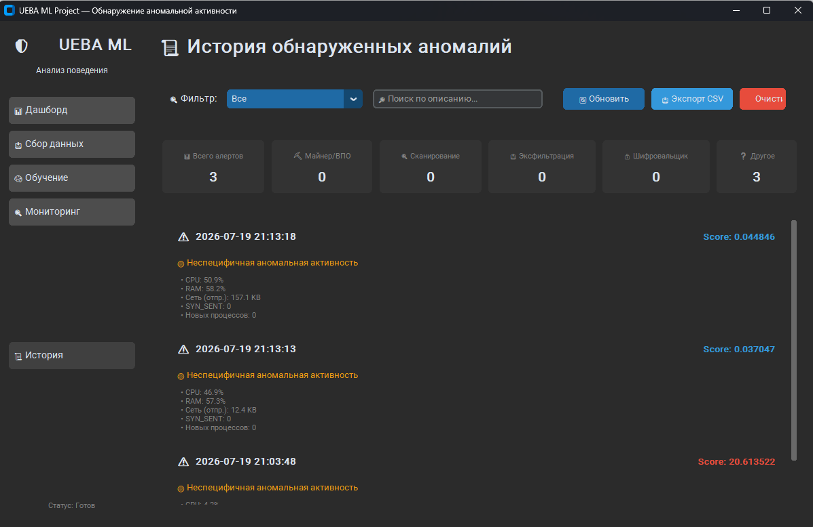

# 🛡️ UEBA ML Project

Программный макет для обнаружения аномальной сетевой и локальной активности на ПК с использованием методов машинного обучения (Unsupervised Anomaly Detection). Проект реализует полный цикл подхода **UEBA** (User and Entity Behavior Analytics): от сбора телеметрии до ИБ-классификации угроз в реальном времени.

---

## 🚀 Ключевые особенности

- **Автоэнкодер на PyTorch**: Поиск отклонений от нормального поведения без необходимости в размеченных данных об атаках.
- **Контекстно-зависимые признаки**: Внедрены метрики `cpu_concentration_ratio` и `process_spawn_rate`, которые позволяют модели отличать легитимные тяжелые задачи (игры, рендеринг) от скрытых майнеров или ботнетов, снижая количество False Positive.
- **Современный GUI**: Удобное десктопное приложение на CustomTkinter с тёмной темой и интерактивными графиками.
- **MLOps-подход к данным**: Поддержка режимов "Дописать" и "Новый сбор с архивацией" для безопасного проведения ML-экспериментов.
- **Полная автоматизация**: Автоматическая нормализация данных при запуске обучения, расчет порога аномальности (Mean + 3*Std) и сохранение артефактов.

---

## 📸 Как это работает (Интерфейс приложения)

Приложение разделено на 5 логических вкладок, обеспечивающих полный жизненный цикл модели:

### 1. 📊 Дашборд
Центральный хаб приложения. Отображает текущий статус системы: собраны ли данные, обучена ли модель, какой порог аномальности установлен. Позволяет быстро оценить готовность системы к работе.



### 2. 📥 Сбор данных
Модуль телеметрии, собирающий 12 поведенческих метрик ОС (CPU, RAM, Disk I/O, Network, TCP-статусы, процессы) с настраиваемым интервалом. 
- **Режим "Дописать"**: Накопление данных для улучшения профиля пользователя.
- **Режим "Новый сбор"**: Автоматическое архивирование старого датасета с timestamp и начало сбора с чистого листа.



### 3. 🧠 Обучение модели
Вкладка для тренировки Автоэнкодера. 
- Позволяет выбрать конкретный датасет (текущий или любой из архивных).
- Автоматически выполняет нормализацию (MinMaxScaler) перед стартом.
- Отображает **живой график** потерь (Train/Val Loss) в реальном времени.
- Использует Early Stopping для предотвращения переобучения.



### 4. 🔍 Мониторинг в реальном времени
Ядро системы обнаружения угроз. Считывает метрики, нормализует их и прогоняет через обученную модель. 
- Если `Anomaly Score` превышает порог, система мгновенно генерирует алерт.
- **ИБ-Классификация**: На основе вклада конкретных признаков в ошибку модель объясняет угрозу (например: *"🔴 Подозрение на скрытый майнер"* или *"🔴 Сканирование сети"*).



### 5. 📜 История аномалий
Журнал всех зафиксированных инцидентов. Поддерживает:
- Фильтрацию по типу угрозы (Майнер, Сканирование, Эксфильтрация и т.д.).
- Текстовый поиск по описанию.
- Экспорт всех алертов в формат CSV для дальнейшего анализа.



---

## 🛠️ Стек технологий

| Категория | Технологии |
|-----------|------------|
| **Язык** | Python 3.9+ |
| **Machine Learning** | PyTorch, Scikit-learn, Pandas, NumPy |
| **GUI** | CustomTkinter, Matplotlib |
| **Системный мониторинг** | Psutil |
| **Сборка** | PyInstaller |

---

## 📦 Установка и запуск

1. Клонируйте репозиторий:
   ```bash
   git clone https://github.com/Light896cart/UEBA.git
   cd UEBA
